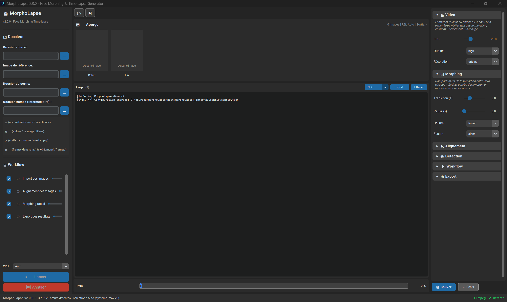
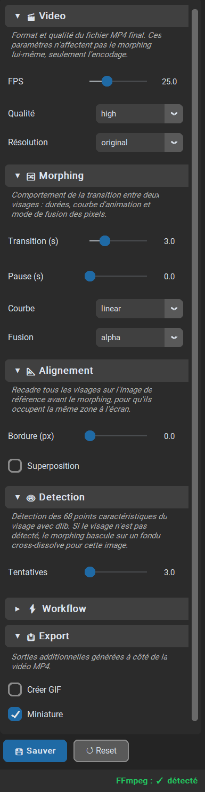
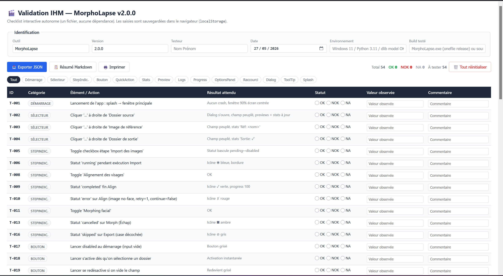
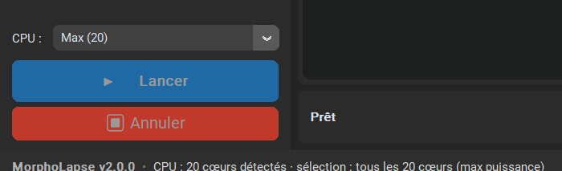

# MorphoLapse



Générateur de vidéos time-lapse à partir d'une série de photos de visage : détection des 68 points dlib, alignement Procrustes, morphing par triangulation Delaunay, encodage H.264 via FFmpeg. Interface CustomTkinter (mode GUI) ou ligne de commande.

## Installation

Pré-requis : Python 3.10+, [FFmpeg](https://ffmpeg.org/download.html) accessible dans le `PATH`, et le modèle dlib `shape_predictor_68_face_landmarks.dat` placé dans `assets/` (téléchargeable [ici](http://dlib.net/files/shape_predictor_68_face_landmarks.dat.bz2)).

```bash
git clone https://github.com/Kiriiaq/MorphoLapse.git
cd MorphoLapse
pip install -e ".[dev]"     # ou: pip install -r requirements.txt (runtime seul)
```

Exécutables Windows pré-build disponibles via [GitHub Releases](https://github.com/Kiriiaq/MorphoLapse/releases) : `MorphoLapse.exe` (onefile, distribution simple) et `MorphoLapse-debug.exe` (console + import trace).

## Usage

### GUI

```bash
python main.py
```

1. Sélectionner le dossier source contenant les photos
2. (optionnel) Image de référence pour l'alignement ; sinon la 1re image est utilisée
3. (optionnel) Dossier de sortie et dossier frames intermédiaire
4. (optionnel) Régler le sélecteur CPU au-dessus du bouton Lancer
5. Cliquer ▶️ Lancer

Raccourcis clavier : `Ctrl+1..5` togglent les sections de l'OptionsPanel (Vidéo, Morphing, Alignement, Détection, Workflow) — fonctionnent aussi sur AZERTY et pavé numérique avec ou sans Num Lock. `Échap` annule un workflow en cours. `F1` affiche la liste des raccourcis.



### CLI

```bash
python main.py --cli -i photos/ -o resultat/
python main.py --cli -i photos/ --fps 30 --transition 2.0 --pause 0.5
```

Toutes les options : `python main.py --help`.

## Structure du projet

```
MorphoLapse/
├── main.py                          # entry-point GUI/CLI
├── build.py                         # driver PyInstaller (3 profils)
├── pyproject.toml                   # metadata + deps + ruff/mypy/pytest
├── Makefile                         # cibles install/lint/test/build/clean
├── requirements.txt                 # pin runtime
├── src/
│   ├── __init__.py                  # __version__ centralisée
│   ├── core/                        # face_detector, face_aligner,
│   │                                #   face_morpher, video_encoder
│   ├── modules/                     # workflow_manager + 4 steps
│   │                                #   (import, align, morph, export)
│   ├── ui/                          # main_window, widgets
│   └── utils/                       # config_manager, file_utils,
│                                    #   image_utils, logger, paths,
│                                    #   splash_screen
├── tests/                           # suite pytest (smoke / functional /
│                                    #   perf / stress / volume)
├── qa/                              # campagne QA manuelle :
│                                    #   matrice Excel 118 tests,
│                                    #   validation_ihm.html (118 tests),
│                                    #   validation_rapide.html (60 tests
│                                    #   focalisés sur les correctifs),
│                                    #   inputs/ datasets synthétiques,
│                                    #   scripts/ générateurs et runners
├── assets/                          # icone.ico + modèle dlib (~99 MB,
│                                    #   non commité)
├── config/                          # config.json (préférences persistées)
├── docs/
│   └── images/                      # captures pour le README
└── .github/workflows/               # CI (lint+test) + release (build+tag)
```

## Développement

```bash
make install                # pip install -e ".[dev]"
make test                   # pytest -q (102 tests, ~6 s)
make test-fast              # exclut les marqueurs @slow
make bench                  # micro-benchmarks tests/perf/
make cov                    # rapport HTML couverture
make lint                   # ruff check + format check
make format                 # ruff check --fix + ruff format
make typecheck              # mypy src/
make build-debug            # PyInstaller debug onefile + console
make build-release          # PyInstaller release onefile (no console)
make build-all              # les deux
make clean                  # purge build/ dist/ *.spec caches
```

### Profils de build PyInstaller

```bash
python build.py debug --onedir       # debug, libs dans _internal/ (rapide)
python build.py release --onedir     # release, libs dans _internal/
python build.py release              # release, single .exe ~203 MB
python build.py all                  # debug + release onefile
python build.py clean                # supprime build/ dist/ *.spec
```

| Layout | Taille EXE | Total disque | Cold start |
|---|---|---|---|
| `--onedir` | ~25 MB | ~447 MB (libs externes) | ~300-500 ms |
| `--onefile` | ~203 MB | 203 MB | ~1.5-2 s (extraction `_MEI` dans `%TEMP%`) |

### Procédure de rebuild avant campagne QA

1. `git log -1 --format='%H %s' main` → noter le SHA dans `qa/rapport_qualification.md`
2. `python build.py clean && python build.py all`
3. Vérifier les `mtime` des EXE postérieurs au commit testé
4. Smoke test : `timeout 12 ./dist/MorphoLapse.exe ; echo EXIT=$?` doit retourner `124` (timeout = process vivant)

La campagne manuelle se pilote via `qa/validation_rapide.html` (60 tests focalisés sur les correctifs récents) ou la matrice complète `qa/matrice_tests.xlsx` (118 tests) :



## Configuration

`config/config.json` est généré au premier lancement et regroupe :

- **paths** : `last_input_dir`, `last_output_dir`, `last_reference_image`, `runs_dir`, `intermediate_frames_dir`
- **video** : `quality` (low/medium/high/ultra), `format` (mp4), `resolution` (original / 1080p / 720p / 480p)
- **morphing** : `fps` (10-60), `transition_duration` (0.5-10 s), `pause_duration` (0-5 s), `easing` (linear/ease_in/ease_out/ease_in_out/cubic/bounce), `blend_mode` (alpha/additive/multiply/screen)
- **alignment** : `border_size` (0-50 px), `overlay_mode`, `max_detection_attempts`
- **detection** : `threshold`, `retry` (1-5)
- **workflow** : `continue_on_error`, `debug_mode`, `cpu_threads` (`"Auto"` / `"1"` / `"2"` / `"4"` / `"8"` / `"Max (N)"`)
- **export** : `frames`, `landmarks`, `gif`, `thumbnail`
- **ui** : `theme` (dark), `window_width`, `window_height`, `log_level`, `language` (fr)

Variables d'environnement utiles :

- `MORPHOLAPSE_DEBUG=1` — active le logger Python en `DEBUG` dès l'import
- `OMP_NUM_THREADS`, `OPENBLAS_NUM_THREADS`, `MKL_NUM_THREADS` — pilotés automatiquement par le sélecteur CPU si une valeur explicite est choisie



### Frames intermédiaires et viewer HTML

À chaque run, les frames JPEG du morphing sont écrites dans `<dossier_frames>/<timestamp>/` (par défaut `runs/<ts>/03_morph/frames/`, ou le dossier choisi par l'utilisateur). Un `preview.html` autonome est généré dans le même dossier : double-clic pour scruber la séquence (slider, play/pause, flèches clavier, vitesse 0.25× à 4×). La vidéo finale `morph_video.mp4` est copiée à côté quand l'encodage réussit ; le `<video>` du HTML devient lisible après un `F5`.

Les frames sont conservées même en cas d'échec de l'encodage FFmpeg, ce qui permet de recompiler avec n'importe quel outil externe :

```bash
ffmpeg -framerate 25 -i frame_%06d.jpg -c:v libx264 -preset medium -crf 23 -pix_fmt yuv420p morph.mp4
```

## Licence

MIT — voir [LICENSE](LICENSE). Crédits : [face-movie](https://github.com/andrewdcampbell/face-movie) (Andrew Campbell, projet original), [dlib](http://dlib.net/), [CustomTkinter](https://github.com/TomSchimansky/CustomTkinter), [FFmpeg](https://ffmpeg.org/).
